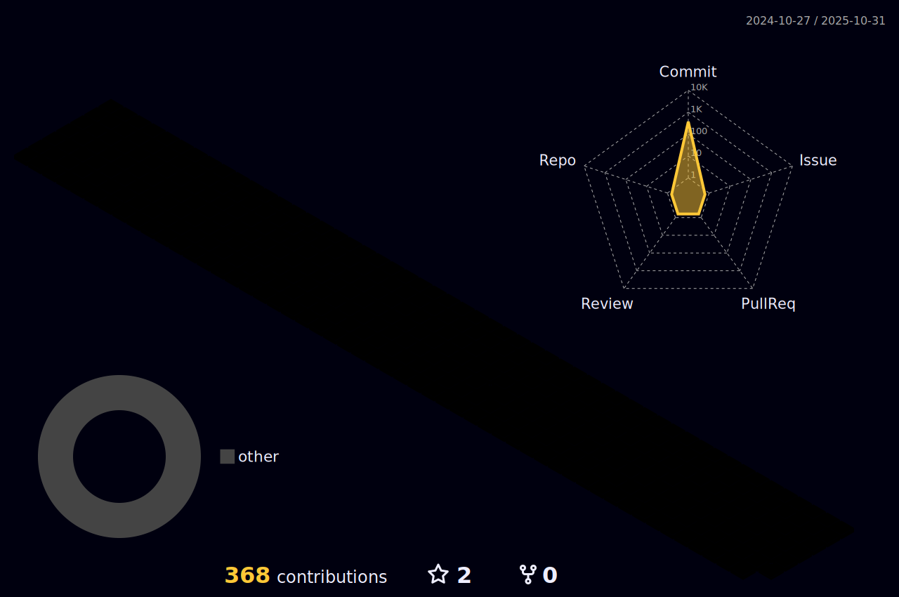

# Welcome to Bellday's Github!! 

1일 1깃허브를 통해 발전하고자 하는 개발자입니다.

차량 SW엔지니어를 목표로 하고 있으며 주력 언어는  Python, C++, C를 배우고 있습니다~

방문해주셔서 감사합니다~

  

<!--
[Top Langs](https://github-readme-stats.vercel.app/api/top-langs/?username=bellday&layout=compact)
-->

